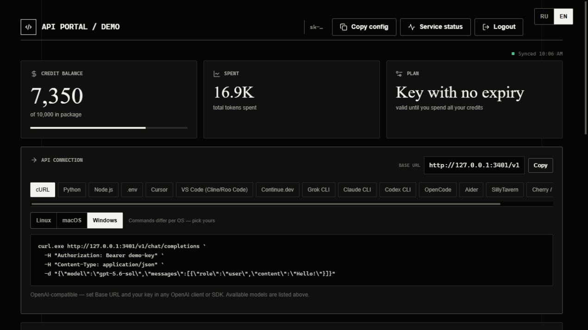
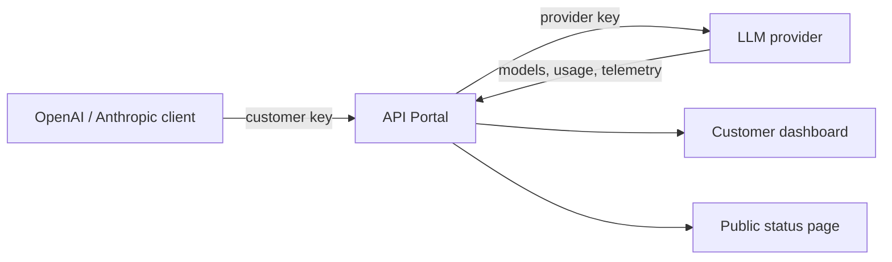
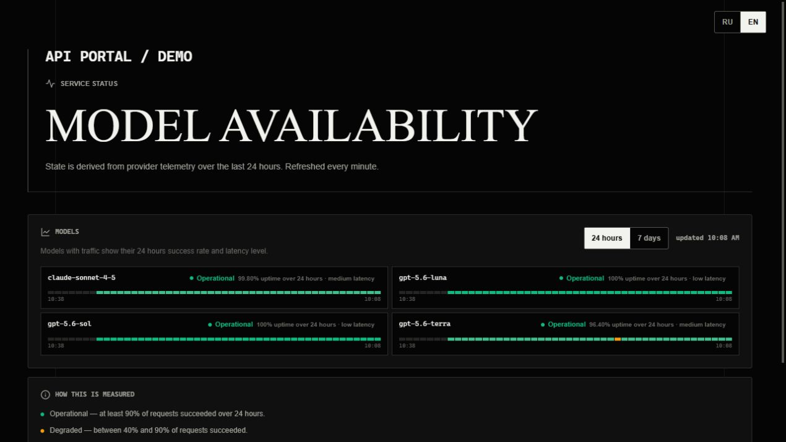

# API Portal

[](https://github.com/Sereza111/api_portal/actions/workflows/ci.yml)
[](https://nodejs.org/)
[](LICENSE)
[](package.json)

Self-hosted customer portal and transparent reverse proxy for an
OpenAI/Anthropic-compatible API provider.

Customers get a key and a Base URL pointing at your domain. They connect any
compatible client, and the portal shows what they spent, what a request cost,
which models they may call and whether those models are currently healthy.
Your provider key never leaves the server.

Zero npm dependencies. Node 18+, stdlib only.



## Why API Portal

API Portal is the customer-facing layer that a raw LLM gateway usually lacks.
It keeps the provider credential server-side while giving each customer a
clear view of balance, request-level cost, model access and service health.

| For operators | For customers |
|---|---|
| One upstream credential stays on the server | One compatible Base URL and key |
| Allowlisted and passthrough access modes | Usage, spend and request history |
| Docker, systemd and nginx examples | Live model availability and pricing |
| Provider telemetry with graceful fallback | Setup snippets for popular clients |

### Architecture



## Try the demo

The repository includes a local mock provider, so the complete UI can be
reviewed without an API account or paid requests:

```bash
npm run demo
```

Open `http://127.0.0.1:3401`, sign in with `demo-key`, and visit
`http://127.0.0.1:3401/status` for the public status page.



---

## What it does

**Transparent proxy** — `ANY /v1/*` is forwarded upstream unchanged, including
streaming (SSE passes through unbuffered). Two key modes, usable together:

- *Allowlisted*: keys in `CLIENT_KEYS` are swapped for `UPSTREAM_KEY` on the way
  out, so customers never see the real key.
- *Passthrough* (`PASSTHROUGH=1`): a key that is not in the allowlist is
  forwarded as-is. This lets people who already have a provider key point it at
  your domain.

**Customer dashboard** (`/`) — credit balance, spend, per-request history with
the cost of each call, per-model spend, a 14-day chart, the model list with
prices and live health, and copy-paste setup snippets for a dozen clients
(Claude CLI, Cursor, Cline/Roo Code, Continue.dev, Codex CLI, Aider,
SillyTavern, Cherry Studio, plain curl, Python, Node). Snippets adapt to the
visitor's OS and substitute a model the key is actually entitled to. RU/EN.

**Public status page** (`/status`, optionally also a `status.` subdomain) —
per-model availability with a 24h/7d history strip, no login and no prices.
The dashboard button defaults to the same-origin route, so separate DNS is not
required. A status subdomain remains supported with a restricted route set.

---

## Quick start

```bash
cp .env.example .env      # fill in UPSTREAM_BASE and UPSTREAM_KEY
set -a && . ./.env && set +a
node server.js
```

`server.js` does not read `.env` on its own — export the variables first (the
line above) or hand them to systemd via `EnvironmentFile=`.

Verify:

```bash
curl -s localhost:3401/healthz                       # -> ok
curl -s localhost:3401/api/config                    # -> base_url, languages
curl -s localhost:3401/v1/models                     # -> 401 without a key
curl -s -H 'Authorization: Bearer <key>' localhost:3401/v1/models
```

---

## Configuration

Every variable is documented in `.env.example`. The ones that matter:

| Variable | Meaning |
|---|---|
| `UPSTREAM_BASE` | Provider origin, no trailing `/v1` |
| `UPSTREAM_KEY` | Your provider key, swapped in for allowlisted client keys |
| `CLIENT_KEYS` | Comma-separated keys you hand to customers |
| `PASSTHROUGH` | `1` forwards unknown keys upstream unchanged |
| `PUBLIC_ORIGIN` | Optional public origin; otherwise derived from proxy headers |
| `PUBLIC_BASE_URL` | Optional full Base URL override, including the API path |
| `STATUS_URL` | Optional external status page; defaults to same-origin `/status` |
| `PORTAL_NAME` | Brand text shown in the portal |
| `CREDITS_PER_USD` | Credit scale. `10000` means 1 credit = $0.0001 upstream |
| `UPSTREAM_DASHBOARD_TOKEN` | Optional New API management token; powers the full status page |
| `UPSTREAM_SESSION`, `UPSTREAM_SESSION_USER` | Legacy dashboard authentication fallback |

### About the credit unit

Prices and balances are published in **credits**, never in the provider's own
quota units or dollars. `CREDITS_PER_USD` sets the scale and every published
number derives from it — the price list, the per-request cost, the balance.
Change it in one place and the whole portal follows.

### About the status page

Without dashboard authentication the status page falls back to your own request log,
which only sees models your traffic actually touched — typically a third of the
catalog, with the rest showing "no data". With provider dashboard access it
reports the provider's own telemetry for every model.

For current New API releases, create a management **Access Token** under
Profile -> Security and put it in `UPSTREAM_DASHBOARD_TOKEN`. It is not an
`sk-*` model API key. The portal reads the paginated administrative request log
and aggregates traffic across all customer tokens without exposing raw rows.
`UPSTREAM_SESSION` plus `UPSTREAM_SESSION_USER` remain available only for older
deployments that provide the legacy service-status endpoint. If dashboard
authentication expires or is revoked, the page degrades to the local request
log rather than breaking.

A model with no traffic in the window is reported as **no data**, never as an
outage, and it does not count toward the failure badge. Only observed failures
(`down`, `degraded`) do.

---

## Deploy (systemd + nginx)

```bash
useradd -r -s /usr/sbin/nologin api-portal
mkdir -p /opt/api-portal /etc/api-portal
cp -r server.js package.json public /opt/api-portal/
cp .env.example /etc/api-portal/gateway.env   # then edit it
chmod 600 /etc/api-portal/gateway.env
chown -R api-portal:api-portal /opt/api-portal

cp deploy/api-portal.service /etc/systemd/system/
systemctl daemon-reload
systemctl enable --now api-portal
```

`deploy/portal.conf.example` is a matching nginx vhost: TLS, both hostnames on
one upstream, and the long read timeouts streaming needs (a 10-minute
completion must not be cut off at 60s).

For the status subdomain, include it in the certificate:

```bash
certbot certonly -d example.com -d www.example.com -d status.example.com
```

---

## Deploy (Docker / Portainer)

The repository includes a `Dockerfile` and `compose.yaml`. In Portainer create
a **Stack** from this Git repository (the Compose path is `compose.yaml`), then
add the variables below under **Environment variables** before deploying. If
you deploy locally, copy `.env.example` to `.env` and run:

```bash
docker compose up -d --build
```

Portainer must publish the container port as `3401:3401` (already defined in
`compose.yaml`). Put an HTTPS reverse proxy such as Nginx Proxy Manager,
Traefik, or Caddy in front of it and proxy to `api-portal:3401` on the Docker
network. Do not expose this port directly to the Internet unless TLS is
terminated elsewhere.

Required variables:

| Variable | Value |
|---|---|
| `UPSTREAM_BASE` | Provider base URL, without a trailing `/v1`, for example `https://provider.example` |
| `UPSTREAM_KEY` | Your private key at that provider; required when using allowlisted keys |
| `CLIENT_KEYS` | Comma-separated customer keys, for example `customer-1,customer-2` |
| `PASSTHROUGH` | `0` to accept only `CLIENT_KEYS`; `1` also forwards unknown client keys upstream |
| `PUBLIC_ORIGIN` | Optional public HTTPS origin; leave empty to use forwarded host/protocol |
| `PUBLIC_BASE_URL` | Optional full API URL override, for example `https://api.example.com/v1` |
| `STATUS_URL` | Optional external status URL; defaults to `<portal>/status` |

Recommended values: `MAX_BODY_BYTES=104857600` and `CREDITS_PER_USD=10000`.
`UPSTREAM_DASHBOARD_TOKEN` is optional and enables full provider telemetry on
the status page. The two `UPSTREAM_SESSION*` settings are only a legacy
fallback. `HOST` must remain `0.0.0.0` in a container; it is set by the Compose
file.

---

## Notes on behaviour worth knowing

**Balance vs history can disagree for a minute.** The provider reserves quota
*before* a request runs, based on `max_tokens`, and writes the log row only
*after* it finishes. During a long streaming call the balance already reflects
a reservation that has no log row yet, so "spent" can exceed the sum of the
history. The excess is returned on completion. Both numbers come straight from
the provider; neither is computed here.

**Rate limits are absorbed, not surfaced.** Provider endpoints rate-limit
independently of each other, and a dashboard refresh fans out to several. Each
is cached per key with a stale fallback, so a 429 serves the last good snapshot
instead of showing the customer an error or a zeroed chart. A degraded snapshot
never overwrites a good one.

New API's critical limiter is IP-based. Because every portal request originates
from the portal host, keep `CRITICAL_RATE_LIMIT` high enough for the expected
number of simultaneous customers or place the portal on a trusted internal
route. The portal minimizes this shared budget: balance checks run before
optional history, customer snapshots are cached for five minutes, and public
status samples at most 100 recent administrative log rows per five minutes.

**Failed requests are free.** Rows the provider bills at zero (5xx, overload)
appear in the history as failures with no charge, so a customer can see the
retries without being charged for them.

---

## License

MIT
